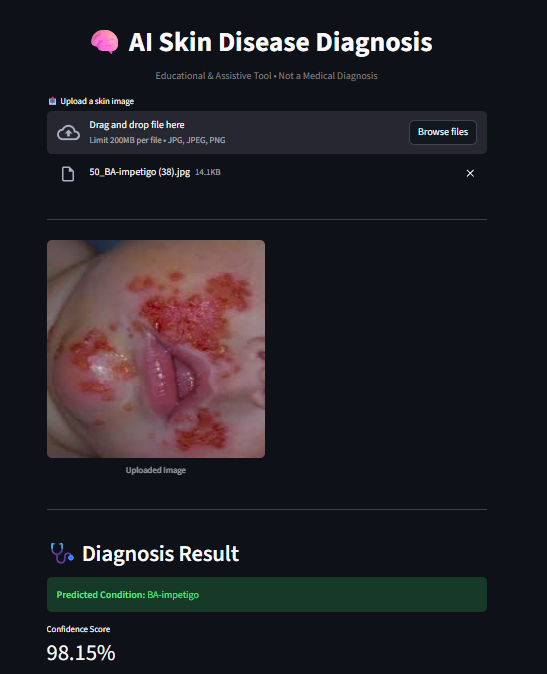
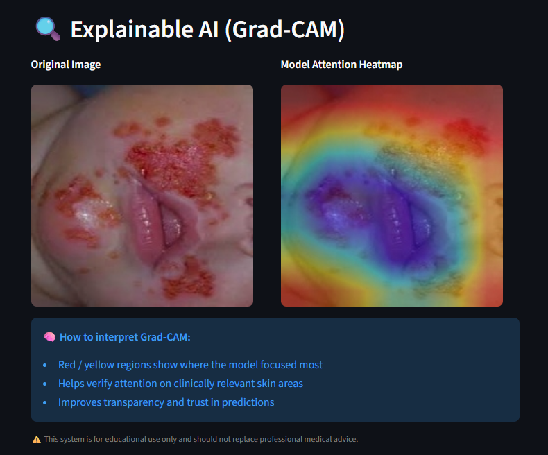

# 🧠 Skin Disease CNN Classification with Explainable AI (Grad-CAM)

[](https://www.python.org/)
[](https://jupyter.org/)
[](https://pytorch.org/)
[](LICENSE)

A deep learning pipeline for **automated skin disease classification** using a fine-tuned **ResNet-30 CNN**, enhanced with **Explainable AI (XAI)** through **Gradient-weighted Class Activation Mapping (Grad-CAM)** to provide visual explanations for model predictions.

---

## 📌 Overview

Skin disease diagnosis is a critical yet challenging task in clinical dermatology. This project leverages transfer learning on a ResNet architecture to classify skin conditions from dermoscopic images, while using Grad-CAM to highlight the regions of the image that most influenced the model's decision — bridging the gap between black-box AI and clinical interpretability.

---

## ✨ Features

- 🔬 **Fine-tuned ResNet** model on a curated skin disease dataset
- 🗺️ **Grad-CAM visualizations** for explainable, interpretable predictions
- 📊 Training metrics: accuracy, loss curves, confusion matrix
- 🌐 **Streamlit web app** (`app.py` / `app1.py`) for interactive inference
- 🧩 Modular codebase with `main.py` entry point
- 📦 `pyproject.toml` and `requirements.txt` for easy environment setup

---

## 🗂️ Project Structure

```
├── Restnet30_finetuned_skin_dataset.ipynb   # Main training & evaluation notebook
├── app.py                                   # Streamlit web app (version 1)
├── app1.py                                  # Streamlit web app (version 2)
├── main.py                                  # Entry point for CLI inference
├── model.json                               # Model architecture / metadata
├── requirements.txt                         # Python dependencies
├── pyproject.toml                           # Project configuration
├── Demo1.png                                # Demo output screenshot 1
├── Demo2.png                                # Demo output screenshot 2
└── Screenshot *.png                         # Training/result screenshots
```

---

## 🖼️ Demo

| Input Image | Grad-CAM Heatmap |
|:-----------:|:----------------:|
|  |  |

---

## 🚀 Getting Started

### Prerequisites

- Python 3.8+
- pip or conda

### Installation

```bash
# Clone the repository
git clone https://github.com/tanay011/Skin-Disease-CNN-Classification-with-Explainable-AI-Grad-CAM-.git
cd Skin-Disease-CNN-Classification-with-Explainable-AI-Grad-CAM-

# Install dependencies
pip install -r requirements.txt
```

### Run the Web App

```bash
streamlit run app.py
```

### Run CLI Inference

```bash
python main.py --image <path_to_image>
```

### Open the Notebook

```bash
jupyter notebook Restnet30_finetuned_skin_dataset.ipynb
```

---

## 🧪 Model Details

| Property        | Details                        |
|----------------|-------------------------------|
| Architecture   | ResNet (fine-tuned)            |
| Dataset        | Skin disease image dataset     |
| Framework      | PyTorch / TensorFlow           |
| XAI Method     | Grad-CAM                       |
| Input Size     | 224 × 224 px                   |

---

## 📈 Results

Training and evaluation results, including accuracy curves and Grad-CAM overlays, are documented in the notebook and captured in the screenshot files.

---

## 🛠️ Tech Stack

- **Deep Learning**: PyTorch / TensorFlow, ResNet
- **Explainability**: Grad-CAM
- **Web App**: Streamlit
- **Notebook**: Jupyter
- **Language**: Python

---

## 🤝 Contributing

Contributions are welcome! Feel free to open issues or submit pull requests.

---

## 👤 Author

**Kunal Jagtap** — [@tanay011](https://github.com/tanay011)

---

## 📄 License

This project is licensed under the [MIT License](LICENSE).
